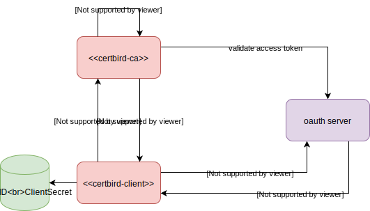

# Authentication & authorization with certbird

It is important to validate that the requesting subject is actually allowed to request an ssl certificate. There are different approaches you can take.

## OAuth2.0

### SSL Certificates Flow

Using OAuth with the [Client Credential Flow](https://auth0.com/docs/flows/concepts/client-credentials) allows your webservers to automatically request ssl certifiactes. You can control which servers can request certificates for which Subject Alternative Names (SANs) by configuring the correct claim in your OAuth server.

In this example the claim to hold the SANs that the webserver is allowed to request SSL certificates for is called `ssl_sans`. To request an access token with this claim the webserver transmits its client ID and client secret to the OAuth server with a request for the `ssl_cert_req` scope. Specifying this scope will let the OAuth server include the claim `ssl_sans` into the access token. The claim `ssl_sans` contains a comma separated list of DNS names that the server may request SSL certificates for e.g. `"my.website.com,124.23.3.5"`.

With this access token the webserver can send a certificate request to the CA service. The CA service will check the validity of the access token and validate that all requested SANs are included in the `ssl_sans` claim of the webserver.

If this validation is successful the CA service will return a signed SSL certificate.

### Intermediate CA Certificate Flow

A similar flow is available for requesting intermediate CA requests. The following scopes and claims are used.

- Scope: `ssl_cert_ca` includes the claim `ssl_ca`
- Claim: `ssl_ca:` can be true or false

Only if the claim `ssl_ca` is `true` the CA service will provide an intermediate CA certificate to the client.

