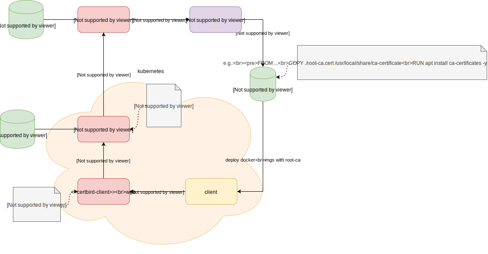

# Usecase: Certbird with kubernetes

This usecase describes how to run certbird in a kubernetes cluster.

We use a hierarchical approach to certificate creation. The root CA is located outsite the kubernetes cluster and can be reused across and with other systems.

Inside the kubernetes cluster we run an intermediate CA that automatically retrieves an intermediate certificate from the root CA. Each instance of the intermediate CA retrieves its own intermediate certificate on startup and when expiring. Rotation at the intermediate CA should be often but not overwhelming to the root CA e.g. once every day. The ability to scale this intermediate CA via kubernetes allows many subjects to rotate their SSL certificates very often, e.g. less than 30 mins.

All docker containers deployed to kubernetes should be build with the root CA certificate already embedded. This can be setup at your build server. You can fetch the certificate from the root CA service. When building the docker image you copy and activate the root CA certificate in the docker OS. This allows the created pods to trust the SSL certificates signed by the intermediate CAs.

